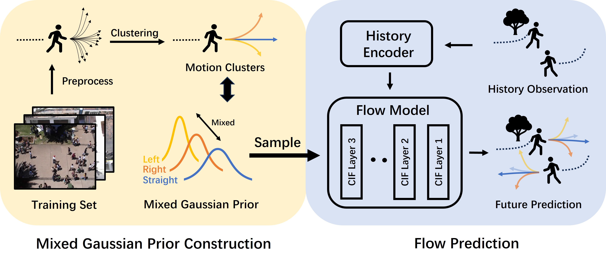

# MGF: Mixed Gaussian Flow for Diverse Trajectory Prediction
**[Neurips'24]** PyTorch Implementation of "MGF: Mixed Gaussian Flow for Diverse Trajectory Prediction". (https://arxiv.org/abs/2402.12238)



## Installation
### Environment
```bash
conda create -n mgf python=3.9
conda activate mgf
pip install -r requirements.txt
```

### Data
```
python src/data/TP/process_data.py
```

## Evaluation
### Run Inference
```bash
python src/test.py --scene {scene_name}
```
- scene_name = eth/hotel/univ/zara1/zara2/sdd

### Expected Results

|      | ETH  | HOTEL | UNIV | ZARA1 | ZARA2 | SDD   |
| ---- | ---- | ----- | ---- | ----- | ----- | ----- |
| ADE  | 0.40 | 0.13  | 0.21 | 0.17  | 0.14  | 7.74  |
| FDE  | 0.59 | 0.20  | 0.39 | 0.29  | 0.24  | 12.17 |
